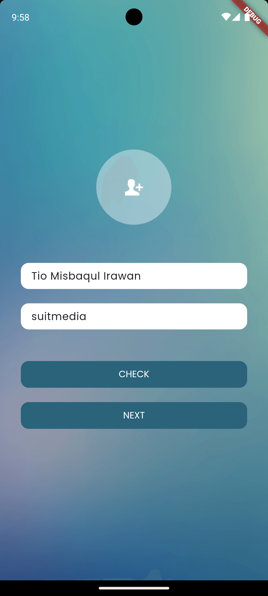
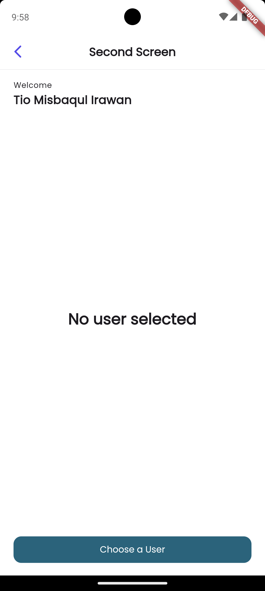

# Suitmedia MSIB Test

This app is created for Suitmedia Mobile Software Engineer Internship Test.

## Features

- Palindrome checker
- Name input
- API users list

## Screenshots

<div style="display: flex; flex-wrap: wrap; justify-content: space-between;">
  
  
  
</div>
<div style="display: flex; flex-wrap: wrap; justify-content: space-between;">
  
  
  
</div>


## Installation

This app requires [Flutter](https://flutter.dev/) version 3.2.3 or higher to run.

Install the dependencies using flutter pub get

```sh
flutter pub get
```

This app also depends on [build_runner](https://pub.dev/packages/build_runner) to generate some part of the code. So whenever the code with code generation is changed, run this command to generate the code.

```sh
dart run build_runner build --delete-conflicting-outputs
```

## Usage

To run the app, use this command

```sh
flutter run
```

## Testing

To run the unit test, use this command

```sh
flutter test
```

To run the integration test, use this command

```sh
flutter test integration_test
```

## Convention

This app uses [Effective Dart](https://dart.dev/guides/language/effective-dart) as the coding convention.

Some other conventions used in this app are:

- Screens are suffixed with `Screen`, e.g. `FirstScreen`
- Models are suffixed with `Model`, e.g. `UserModel`
- Repositories are suffixed with `Repository`, e.g. `UserRepository`
- Application Services are suffixed with `Service`, e.g. `UserService`
- Controllers are suffixed with `Controller`, e.g. `UserController`